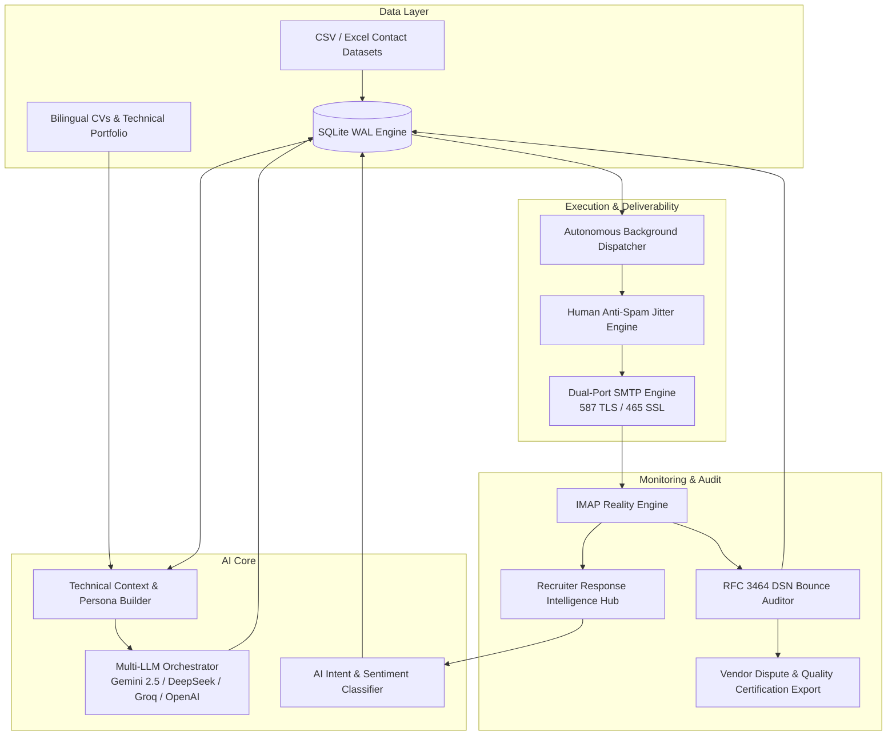

# ⚡ AI Cold Outreach Engine & Smart Recruitment Automation
> **Enterprise-grade, AI-driven Cold Outreach, Deliverability Auditing (RFC 3464), and Recruiter Response Intelligence Platform.**

[](https://www.python.org/)
[](https://streamlit.io/)
[](https://ai.google.dev/)
[](https://www.deepseek.com/)
[](https://groq.com/)
[](https://www.sqlite.org/)
[](https://datatracker.ietf.org/doc/html/rfc3464)
[](https://opensource.org/licenses/MIT)

---

## 🎯 Executive Overview

The **AI Cold Outreach Engine** is an intelligent, high-deliverability email automation platform designed for engineering candidates, researchers, and technical professionals targeting competitive internships, master thesis placements (PFE), and R&D roles across Europe, North America, and international tech hubs.

Unlike conventional mass-mailing tools, this engine pairs **deep technical profile contextualization** with **strict deliverability auditing** and **real-time recruiter response intelligence**.

---

## 🏛️ System Architecture



---

## 🌟 Key Capabilities

### 1. 🤖 Multi-LLM Hyper-Personalized Copywriting
- **Target Role Alignment**: Dynamically adapts tone, technical depth, and call-to-action according to recipient persona (CTO, Lead Embedded Engineer, R&D Director, Technical Recruiter, or Founder/CEO).
- **Project Highlighting**: Injects relevant technical accomplishments (e.g. *Autonomous Drones, High-Voltage Inspection, Embedded Systems, FreeRTOS, SCADA, Robotics*) with quantifiable impact.
- **Bilingual Context Switching**: Automatically detects language (French/English) based on recipient location and company domain.

### 2. ⚡ Autonomous Background Dispatch Engine
- Runs as an independent, detached Python worker daemon.
- **Browser-Independent**: You can close your browser, turn off your device, or switch networks—the server continues dispatching scheduled batches safely.
- **Configurable Anti-Spam Protection**: Inter-email random delays (e.g. 35s–65s) and daily quota throttling to protect domain sender score.

### 3. 🔍 RFC 3464 Google IMAP Bounce Auditor
- Uses `X-GM-RAW` direct IMAP protocol search to capture non-delivery reports (DSN RFC 3464).
- Distinguishes genuine delivered emails from fake/generated vendor data (`550 5.1.1 User unknown`).
- Exports certified Excel audit reports with exact diagnostic codes for vendor dispute and credit replacement.

### 4. 💬 Recruiter Response Intelligence Hub
- Real-time Gmail inbox listener filtering out automated notifications and job-board blasts.
- Automatically extracts genuine recruiter responses (Airbus, MBDA, Cegelec, FlyRénov, Harmattan AI, Parrot, Exail, etc.).
- **AI Intent Extraction**: Classifies messages into 🎯 *Interview Proposals*, 🟡 *Information Requests*, 🔴 *Polite Rejections*, or ⚪ *Out of Office*.
- **Suggested Reply Generator**: Produces pre-written, highly tailored responses ready to review and send with 1 click.

---

## 📁 Repository Structure

```
ai-cold-outreach-engine/
│
├── app.py                      # Modern SaaS Streamlit Web Dashboard
├── config.py                   # System configuration, data schemas & profiles
├── requirements.txt            # Python production dependencies
├── Procfile                    # Cloud process declaration
├── render.yaml                 # Render cloud deployment blueprint
├── README.md                   # Technical documentation
│
├── services/
│   ├── background_sender.py    # Autonomous background dispatch worker
│   ├── response_tracker.py     # IMAP harvester & AI recruiter response analyzer
│   ├── prompt_builder.py       # Technical prompt engineering & language routing
│   ├── llm_service.py          # Unified Multi-LLM API connector
│   ├── email_sender.py         # Dual-port SMTP sender with inline assets
│   ├── gmail_cleaner.py        # RFC 3464 bounce cleaner & DB synchronization
│   ├── analytics_service.py    # Quality metrics & company report generator
│   ├── contact_manager.py      # CSV/Excel parser & name cleaning engine
│   └── storage_service.py      # SQLite thread-safe WAL database persistence
│
├── data/
│   ├── sample_contacts.csv     # Starter template for contact import
│   ├── outreach.db             # Local SQLite database (auto-generated)
│   ├── assets/                 # Brand logos and media assets
│   └── uploads/                # Attached PDF CVs and portfolios
│
└── scripts/
    ├── deep_5pass_audit.py     # 5-pass system validation & certification test
    ├── verify_each_contact_strictly.py # Contact-by-contact IMAP verification tool
    └── infinite_validation_loop.py    # Multi-cycle regression test suite
```

---

## 🚀 Getting Started

### 1. Prerequisites
- Python `3.10` or higher
- A standard Gmail account with an **App Password** enabled (or any standard SMTP/IMAP provider)
- *(Optional)* Google Gemini API key from [Google AI Studio](https://aistudio.google.com/)

### 2. Installation
```bash
# Clone the repository
git clone https://github.com/medhsiny2003/ai-cold-outreach-engine.git
cd ai-cold-outreach-engine

# Create and activate virtual environment
python -m venv venv
# On Windows:
venv\Scripts\activate
# On Linux/macOS:
source venv/bin/activate

# Install dependencies
pip install -r requirements.txt
```

### 3. Environment Variables
Create a `.env` file in the root directory:
```env
# Optional AI API Key (Free on https://aistudio.google.com/app/apikey)
GEMINI_API_KEY=your_gemini_api_key_here

# Gmail SMTP Configuration
GMAIL_SENDER_EMAIL=your_email@gmail.com
GMAIL_APP_PASSWORD=your_16_letter_app_password
```

### 4. Run Locally
```bash
streamlit run app.py
```
Access the web dashboard at `http://localhost:8501`.

---

## ☁️ Cloud Deployment

### Streamlit Community Cloud
1. Fork this repository to your GitHub account.
2. Visit [share.streamlit.io](https://share.streamlit.io/) and create a **New App**.
3. Select this repository and set `app.py` as the main file path.
4. Deploy in 1 click.

### Render Cloud
This repository includes a [`render.yaml`](render.yaml) configuration ready for web service hosting with Python 3.11+.

---

## 🛡️ Security & Privacy

- **Zero Credential Exposure**: Private credentials and app passwords are never committed or exposed publicly.
- **Local SQLite Storage**: Contact data, email logs, and generated drafts remain on your private database instance.
- **1-Click Disconnect**: Includes a full emergency disconnect switch to instantly stop background daemons and clear cached credentials.

---

## 📄 License
This project is distributed under the **MIT License**. See `LICENSE` for details.
